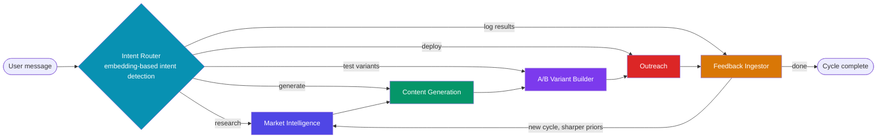
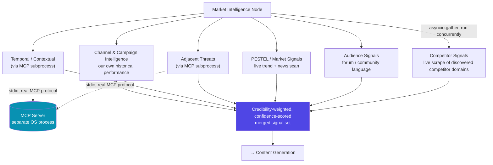
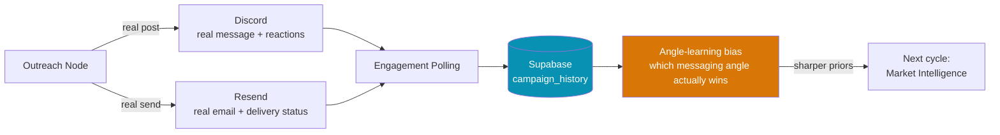

# Veracity — Signal to Action

A multi-agent growth-loop system that turns live market signal into deployed, tested outreach — and then learns from how real people actually respond to it.

Point it at any product or company. It researches the market in real time, generates outreach grounded in what it found, deploys A/B-tested variants through real channels (Discord, email), watches how people actually engage, and feeds that back in to sharpen the next cycle. No hardcoded product, no canned demo data, no fabricated metrics.

## This is not a single LLM call behind an API key

It's easy to glance at a `.env` file full of API keys and assume this is a thin wrapper around one chatbot call. It isn't, and the architecture is built specifically to not be that. A few things that are true here and wouldn't be true of "call an LLM, print the answer":

- **Six independent agent stages**, each a distinct process with its own responsibility, connected by a real orchestration graph (LangGraph) — not one prompt doing everything.
- **Real tool use, not REST wrappers.** Two signal categories (adjacent-market threats, contextual/temporal signals) are served by an actual [MCP](https://modelcontextprotocol.io/) server running as a separate OS subprocess, talking to the agent over stdio with the real Model Context Protocol — the same pattern used for genuine tool-calling agents, not a function call dressed up in an `mcp_tools/` folder name.
- **Parallel, independent research.** Six signal-collection tasks (competitor intelligence, audience signals, PESTEL/market signals, adjacent threats, temporal context, and channel/campaign intelligence) run concurrently via `asyncio.gather`, each able to fail independently without taking the others down.
- **Typed, structured findings with provenance — not free text.** Every signal is a validated, structured record with a source, a confidence score, a domain-credibility weighting, and a raw quote. Every generated outreach variant carries a `provenance_chain` back to the exact signals that produced it, visible in the UI.
- **A closed feedback loop with real consequences.** Content is actually posted to Discord and actually emailed via Resend. Real reactions and real delivery status are polled back, persisted, and used to mathematically bias which messaging angle gets weighted higher next cycle — this is a live learning signal, not a mocked metric.
- **Intent detection without keyword matching.** Routing between research / generate / test / feedback modes is done via sentence-embedding similarity against intent prototypes, so the system detects what the user means from natural conversation instead of requiring explicit mode-switching buttons.
- **Graceful degradation everywhere.** Every external call — scraping, LLM, image generation, Discord, email, MCP — has a typed fallback path. Nothing hard-crashes the pipeline; failures surface as visible warnings, not silent lies.

The API keys in `.env` configure *which* language model and *which* channels this orchestration layer uses — they aren't the product. The product is the graph, the tool boundary, the parallel research, and the closed loop around them.

## Agent Architecture

Six LangGraph nodes share one typed, validated state object (`AgentState`) that flows through the graph — agents don't message each other directly, they read what they need from shared state and write back typed fields, which is what makes the loop-back edge and mid-cycle intent rerouting possible without losing context.



### Inside Market Intelligence: parallel research fan-out

The research stage isn't one call — it's six independent, concurrently-running collectors, two of which go through a real MCP subprocess boundary:



Topic and competitor set are inferred fresh each cycle (one structured LLM call, with a live-search fallback) rather than hardcoded — the same graph runs unmodified whether you ask about an AI SDR startup or a telecom provider in a different market entirely.

### Closing the loop: real engagement, not mocked metrics



Reactions on the Discord message and delivery status on the sent email are pulled (not pushed — no public webhook needed for a local dev backend), written to `campaign_history`, and used to compute which angle (competitor-gap, ROI, or social-proof) is actually winning — that bias carries into the next cycle's content generation.

## What Makes This Different

- **Channel & campaign intelligence** — a signal source derived from our own accumulated cycle history (not an external scrape) that surfaces which outreach channel is actually outperforming, once there's enough cross-channel history to compare.
- **Domain-credibility weighting** — signals aren't trusted equally; a tiered multiplier weights established sources (Reuters, Bloomberg, Gartner, etc.) higher than unverified ones, visible as a badge on every signal card.
- **Provenance on everything generated** — every outreach variant, LinkedIn post, and campaign brief can be traced back to the exact signals that justified it, with confidence scores, in the UI — not just asserted.
- **Angle-learning visualization** — a live chart of which messaging angle is winning over time, recency-weighted, so the "system gets sharper each cycle" claim is something you can actually see happening.
- **Generalizes to any product** — competitor and topic inference happens live per query; nothing is hardcoded to one demo product.
- **Ephemeral, purpose-built UI** — findings, variant grids, channel pickers, and feedback panels materialize inline as the graph executes (streamed live via SSE), not pasted as chat text.

## Tech Stack

| Layer | Stack |
|---|---|
| Orchestration | LangGraph `StateGraph`, typed Pydantic state, Postgres checkpointing |
| Backend | FastAPI, SSE streaming |
| Tool protocol | MCP (Model Context Protocol) over stdio, real subprocess |
| LLM | Claude (structured output via `instructor`) |
| Intent detection | Sentence-transformer embeddings |
| Persistence | Supabase (Postgres) |
| Outreach channels | Discord (bot + reactions), Resend (email + delivery status) |
| Visual artifacts | Next.js `ImageResponse` (deterministic), OpenAI image generation (decorative) |
| Frontend | Next.js, SSE client, ephemeral React components |

## Repo Structure

```text
.
├── backend/    # FastAPI + LangGraph orchestration + MCP servers/clients + tests
└── frontend/   # Next.js UI, SSE consumer, ephemeral UI components, API proxy routes
```

## Running Locally

This is built to be hosted live rather than run from source, so setup here is deliberately minimal.

<details>
<summary>Backend + frontend quick start</summary>

```bash
# Backend
cd backend
py -3.11 -m pip install -r requirements.txt
py -3.11 -m uvicorn main:app --host 127.0.0.1 --port 8000 --reload

# Frontend (separate terminal)
cd frontend
npm install
npm run dev
```

Frontend: `http://localhost:3000` · Backend health check: `GET http://127.0.0.1:8000/`

**Tests:**
```bash
cd backend && py -3.11 -m pytest tests/ -v
cd frontend && npm run lint && npm run build
```
</details>

<details>
<summary>Configuration</summary>

The backend loads secrets from a root `.env` (gitignored). These configure *which* providers the orchestration layer talks to — Claude for structured generation, Discord/Resend for real outreach channels, Supabase for persistence, optional search/news providers for research. Every integration degrades gracefully if its key is absent; nothing here is required for the graph itself to run. See `backend/requirements.txt` and the `mcp_tools/`, `openai_image_gen.py`, and `persistence.py` modules for what each key powers.
</details>
